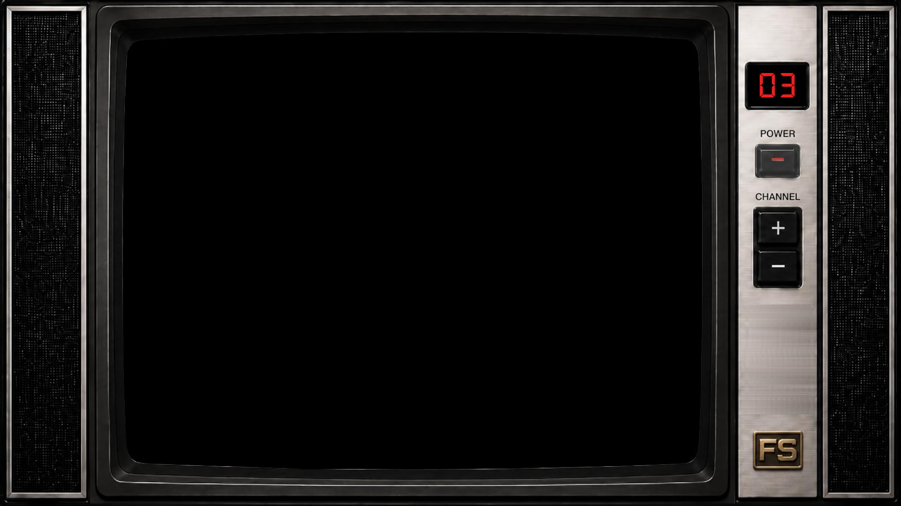

# FieldStation42 Roku Add-on



This repository is a Roku companion add-on for [FieldStation42](https://fieldstation42.com), the open-source broadcast and cable TV simulator by Shane Mason.

It does not include, replace, or redistribute FieldStation42. Install FieldStation42 from the original project first, then install this add-on alongside that existing host setup.

Original FieldStation42 project:

- Website: [fieldstation42.com](https://fieldstation42.com)
- GitHub: [github.com/shane-mason/FieldStation42](https://github.com/shane-mason/FieldStation42)

Credit and thanks go to Shane Mason and the FieldStation42 project. This repo is meant as an add-on for users who already run FieldStation42 with their own host and media.

## What This Adds

- A Roku SceneGraph channel with a retro TV interface.
- A host-side HLS bridge that captures the rendered FieldStation42 display.
- Support for FieldStation42 video channels, guide/weather/web-render channels, and overlays because the bridge captures the screen output.
- Roku-side host/IP settings.
- A bridge-unavailable screen when the Roku cannot reach the host.
- Optional user-level systemd services for FieldStation42 playback and the HLS bridge.

## Repository Layout

```text
fs42-roku/
├── README.md              # Start here
├── install_hls_bridge.sh  # Optional host installer for bridge/systemd setup
├── fs42-stream-bridge/    # hls_bridge.py and bridge-specific notes
└── roku-channel/          # Roku channel source and sideload package
```

The sideloadable Roku zip is built here:

```text
roku-channel/out/roku-deploy.zip
```

## Requirements

FieldStation42 host:

- Linux host or Raspberry Pi
- FieldStation42 installed from the original repo
- FieldStation42 configured with stations, media, schedules, and any web-render channels you want
- Python 3
- `ffmpeg`
- X11 display output, commonly `:0.0`
- PulseAudio or PipeWire Pulse compatibility if you want captured sound
- Roku device on the same LAN

Roku:

- Developer Mode enabled
- Access to the Roku web-based Development Application Installer

## 1. Install FieldStation42

Install FieldStation42 from Shane Mason's upstream repo:

```bash
git clone https://github.com/shane-mason/FieldStation42
cd FieldStation42
bash install.sh
source env/bin/activate
python3 station_42.py
```

Open the FieldStation42 web console:

```text
http://localhost:4242
```

Configure FieldStation42 there before setting up the Roku add-on.

## 2. Install This Add-on

Clone this repo separately from FieldStation42. You do not need to move or reorganize an existing FieldStation42 install.

For example, if FieldStation42 is already installed at one of these paths, leave it there:

```text
/home/pi/FieldStation42
/home/pi/RetroLab/FieldStation42
/opt/FieldStation42
```

Then clone this add-on wherever you see fit:

```bash
git clone https://github.com/realretrolabz/fs42-roku.git
cd fs42-roku
```

When installing the bridge, pass your actual FieldStation42 path with `FS42_DIR`:

```bash
FS42_DIR=/path/to/your/FieldStation42 ./install_hls_bridge.sh
```

The installer has a convenience default of `../FieldStation42` for people who happen to keep both repos side by side, but that layout is not required.

## 3. Install the HLS Bridge

Manual install:

```bash
FS42_DIR=/path/to/your/FieldStation42
cp fs42-stream-bridge/hls_bridge.py "$FS42_DIR/hls_bridge.py"
chmod +x "$FS42_DIR/hls_bridge.py"
```

Optional guided install:

```bash
./install_hls_bridge.sh
```

By default, the installer first checks the current working directory for FieldStation42, then falls back to looking next to this repo as `../FieldStation42`. If neither path matches, it prompts for the real FieldStation42 directory. You can also provide it up front:

```bash
FS42_DIR=/path/to/your/FieldStation42 ./install_hls_bridge.sh
```

The installer prompts for:

- Whether to copy/update `hls_bridge.py` into your FieldStation42 checkout.
- Whether to install `fs42-player.service`.
- Whether to install `fs42-hls-bridge.service`.
- Whether to enable/start selected services immediately.
- Whether to enable user lingering.

It tries to auto-detect the X11 display, capture size, host IP, and PulseAudio monitor source.

## 4. Run FieldStation42 Playback

FieldStation42 needs to be actively playing on the host display because the bridge captures the rendered screen.

From the FieldStation42 directory:

```bash
source env/bin/activate
python3 field_player.py
```

The player status API should be reachable at:

```text
http://<host-ip>:4242/player/status
```

## 5. Run the HLS Bridge

From the FieldStation42 directory:

```bash
./hls_bridge.py --status-url http://127.0.0.1:4242/player/status --display :0.0 --capture-size 720x480 --capture-framerate 24
```

Useful options:

```bash
./hls_bridge.py --public-host <host-ip> --port 8088
./hls_bridge.py --capture-size auto
./hls_bridge.py --capture-size 720x480 --capture-framerate 24
./hls_bridge.py --audio-source pulse --pulse-source auto
./hls_bridge.py --audio-source silent
```

For best Raspberry Pi performance, run the Pi display output at the same resolution you intend to capture. Native Raspberry Pi composite output is commonly `720x480`, so `--capture-size 720x480 --capture-framerate 24` is a good starting point.

If you use an HDMI-to-composite converter, the Pi may still render at `1280x720` or `1920x1080` before the converter downscales the signal. In that case, either lower the Pi HDMI mode or expect higher FFmpeg CPU usage. `--capture-size auto` is the easiest setup option, but it captures the full display framebuffer and can cost more CPU on HD outputs.

The bridge serves:

```text
http://<host-ip>:8088/stream.m3u8
http://<host-ip>:8088/status
```

Open `http://<host-ip>:8088/status` from another device on your LAN to confirm the bridge is reachable.

## 6. Sideload the Roku Channel

The built Roku sideload zip is:

```text
roku-channel/out/roku-deploy.zip
```

Roku's official developer setup guide is here:

```text
https://developer.roku.com/dev/docs/developer-setup
```

To enable Developer Mode, Roku documents this remote sequence:

```text
Home, Home, Home, Up, Up, Right, Left, Right, Left, Right
```

Then:

1. Write down the Roku device URL shown on the Developer Mode screen.
2. Enable the Development Application Installer.
3. Accept the Developer Tools License Agreement.
4. Set a developer password and let the Roku reboot.
5. On a computer on the same network, open the Roku URL in a browser, usually `http://<roku-ip>`.
6. Log in with username `rokudev` and the password you created.
7. In the Development Application Installer, choose Upload.
8. Select `roku-channel/out/roku-deploy.zip`.
9. Upload/install it. The app should launch on the Roku.

Roku only allows one sideloaded app at a time. Uploading another sideloaded app replaces the previous sideloaded app.

## 7. Configure the Roku App

On first launch, the Roku app opens the FieldStation42 host settings screen.

- Press `Options` to reopen host settings later if you need to change or reset the saved address.
- Use Left/Right to select IP octets.
- Use Up/Down to change values.
- Press OK to save.
- Press Back to cancel.

Enter the IP address of the FieldStation42 host, not the Roku IP.

The Roku app uses that host for:

```text
http://<host-ip>:8088/stream.m3u8
http://<host-ip>:8088/status
http://<host-ip>:4242/player/channels/up
http://<host-ip>:4242/player/channels/down
```

If the bridge cannot be reached, the app shows a bridge-unavailable screen and prompts you to open settings.

## Optional systemd Services

The helper installer can create user-level systemd services:

```bash
./install_hls_bridge.sh
```

By default it assumes:

- The current working directory is your FieldStation42 install, if it contains `field_player.py`.
- Otherwise, FieldStation42 may be next to the add-on repo as `../FieldStation42`.
- The script will copy `fs42-stream-bridge/hls_bridge.py` into that FieldStation42 checkout.

That default is only a convenience. If the installer cannot find FieldStation42 there, it prompts for the real path. You can also pass the path yourself:

```bash
FS42_DIR=/home/pi/FieldStation42 \
DISPLAY=:0.0 \
CAPTURE_SIZE=720x480 \
CAPTURE_FRAMERATE=24 \
PUBLIC_HOST=<host-ip> \
./install_hls_bridge.sh
```

You can also override the add-on repo path if you run the installer from another directory:

```bash
ADDON_DIR=/opt/fs42-roku \
FS42_DIR=/home/pi/FieldStation42 \
./install_hls_bridge.sh
```

Depending on your answers, the installer creates:

```text
~/.config/systemd/user/fs42-player.service
~/.config/systemd/user/fs42-hls-bridge.service
```

Useful commands:

```bash
systemctl --user daemon-reload
systemctl --user enable --now fs42-player.service
systemctl --user enable --now fs42-hls-bridge.service
systemctl --user status fs42-player.service
systemctl --user status fs42-hls-bridge.service
journalctl --user -u fs42-hls-bridge.service -f
```

To run user services before login:

```bash
loginctl enable-linger "$USER"
```

FieldStation42's own repository also includes service templates under `install/systemd/`; use those if you prefer the upstream service guidance.

## Rebuilding the Roku Zip

If you edit the Roku channel source, rebuild the sideload zip from the `roku-channel` directory:

```bash
cd roku-channel
mkdir -p out
zip -r out/roku-deploy.zip manifest source components images fonts -x '*.DS_Store'
```

Then upload the rebuilt `roku-channel/out/roku-deploy.zip` through the Roku Development Application Installer.

## Troubleshooting

Bridge unavailable on Roku:

- Confirm `hls_bridge.py` or `fs42-hls-bridge.service` is running on the FieldStation42 host.
- Open `http://<host-ip>:8088/status` in a browser.
- Make sure the Roku and FieldStation42 host are on the same LAN.
- Check firewall rules for ports `8088` and `4242`.

No sound:

- Try `--audio-source pulse --pulse-source auto`.
- Verify the host is playing audio through PulseAudio or PipeWire Pulse compatibility.
- Check the bridge service log with `journalctl --user -u fs42-hls-bridge.service -f`.

Black bars:

- Some source videos include black bars before the bridge captures them.
- Web-render and guide channels may fill differently than video channels.

Channel changes:

- The Roku app locks channel up/down while it waits for the bridge to publish the next HLS generation.
- The bridge clears stale HLS segments when FieldStation42 changes channels.

## Notes

This is a self-hosted companion app. Users provide their own FieldStation42 host and their own media/content. It is intended for GitHub distribution and Roku sideloading rather than Roku Streaming Store publication.
